# 长春高新绩效评价图表说明报告

## 报告用途

本报告用于说明 `outputs/figures/` 中各张图表在长春高新经营绩效评价中的作用、阅读方式和解释意义。它可以作为论文、课程报告或答辩材料中的“图表说明”和“结果解释”基础。

整体图表体系分为四层：

1. **总体判断图**：回答公司绩效走势和综合排名如何变化。
2. **稳健性检验图**：回答 TOPSIS 结论是否可靠，是否依赖单一方法或单一指标。
3. **原因解释图**：回答 2024-2025 年绩效回落主要由哪些指标驱动。
4. **基础趋势图**：回答收入、利润、ROE、资产负债率等原始指标如何演变。

## 一、总体判断图

### 1. Streamlit 趋势页指标面板

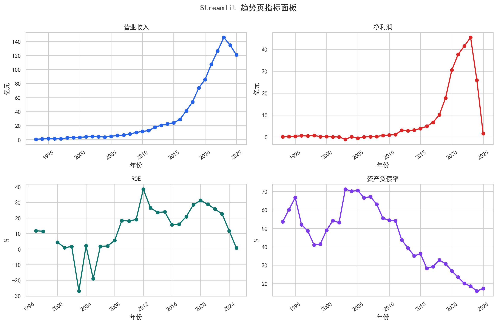

**文件**：`outputs/figures/streamlit_trends.png`

**用途**：把 Streamlit 看板中最核心的趋势图整合成一张多面板图，展示营业收入、净利润、ROE 和资产负债率的长期变化。

**怎么看**：每个子图对应一个关键经营指标。营业收入和净利润用亿元表示，ROE 和资产负债率用百分比表示。横轴为年份，纵轴为指标值。

**说明意义**：该图直观显示长春高新在 2021-2023 年处于高位表现阶段，但 2024-2025 年净利润和 ROE 明显回落。资产负债率仍处于较低区间，说明最新绩效压力主要来自盈利端，而不是高杠杆风险。

**注意事项**：该图是趋势概览，不直接给出综合排名；需要结合 TOPSIS 得分图和退化贡献图判断综合绩效变化。

### 2. TOPSIS 综合绩效得分图

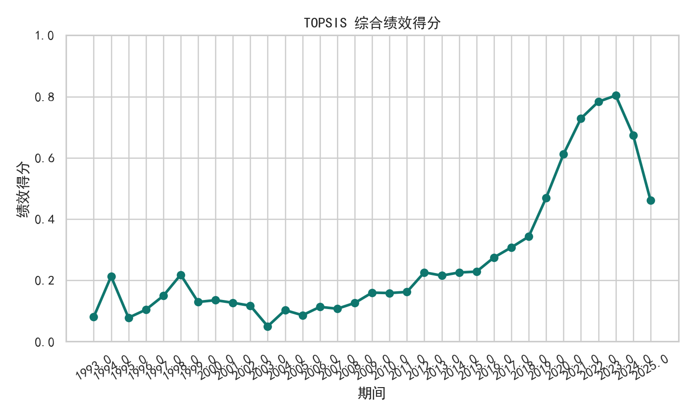

**文件**：`outputs/figures/topsis_score.png`

**用途**：展示每个年度的 TOPSIS 综合绩效得分，是本项目评价公司经营绩效的主结果图。

**怎么看**：得分越接近 1，说明该年度越接近“理想绩效状态”；得分越低，说明与理想状态差距越大。

**说明意义**：该图显示 2023 年为样本期内综合绩效高点，2024-2025 年得分回落，说明公司从高位阶段进入调整阶段。

**注意事项**：TOPSIS 得分是相对评价结果，依赖样本年份、指标体系和权重设置。它适合比较年度之间的绩效强弱，但不等于绝对经营质量评级。

### 3. TOPSIS 排名轨迹图

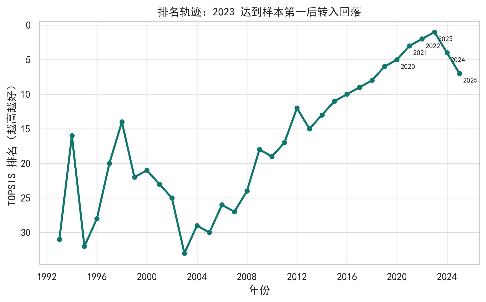

**文件**：`outputs/figures/topsis_rank_bump.png`

**用途**：展示公司在全部年度样本中的绩效排名随时间变化的轨迹。

**怎么看**：纵轴排名越靠上表示绩效越好。曲线向上表示排名改善，向下表示排名下降。

**说明意义**：该图把“2023 年达到样本第一、2024-2025 年回落”的过程表现得更直观，适合用在报告中说明阶段性拐点。

**注意事项**：排名图会放大相对位次变化；若相邻年份得分差距很小，排名变化不一定代表经营质量发生同等幅度变化。

## 二、稳健性检验图

### 4. PCA 稳健性检验图

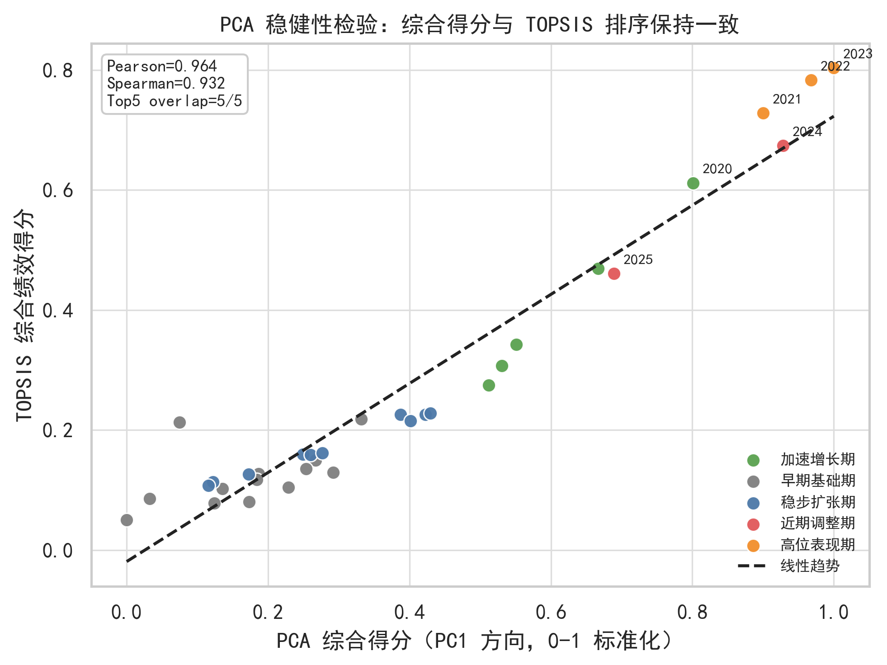

**文件**：`outputs/figures/pca_topsis_robustness.png`

**用途**：检验 PCA 综合得分是否支持 TOPSIS 的绩效排序结论。

**怎么看**：横轴为 PCA 综合得分，纵轴为 TOPSIS 综合绩效得分。点越接近虚线趋势，说明两种方法的判断越一致。

**说明意义**：PCA 与 TOPSIS 得分高度一致，Pearson 相关为 `0.964`，Spearman 相关为 `0.932`，Top5 年份重合 `5/5`。这说明“2021-2023 高位、2024-2025 回落”的主结论并不是 TOPSIS 单一方法造成的偶然结果。

**注意事项**：PCA 是降维方法，主要检验数据结构和排序方向是否一致；它不能替代业务层面的原因解释。

### 5. PCA 二维可视化图

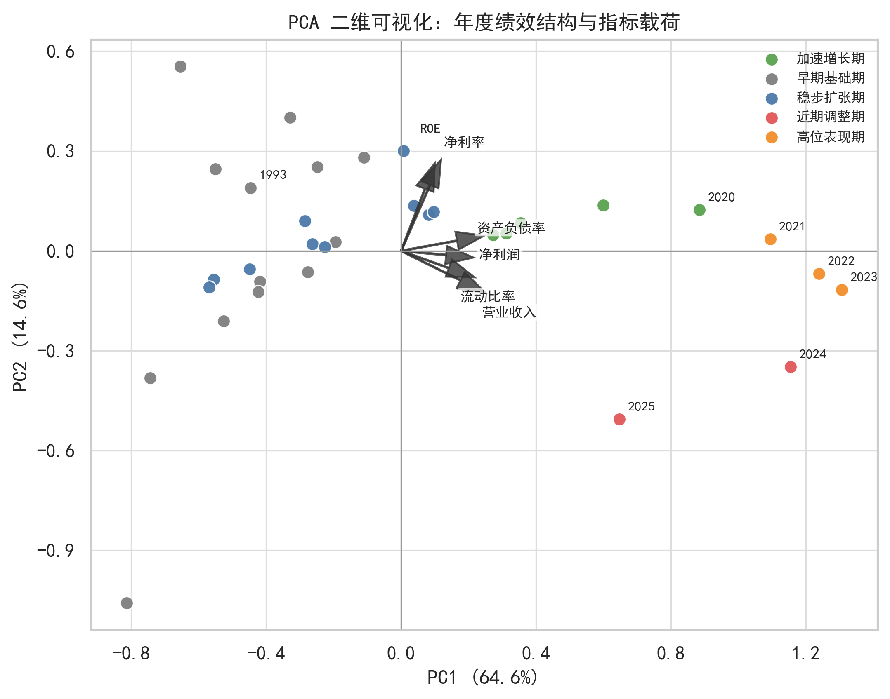

**文件**：`outputs/figures/pca_2d_biplot.png`

**用途**：用 PC1-PC2 二维空间展示各年度绩效样本的位置，并通过指标载荷箭头解释哪些指标驱动年度差异。

**怎么看**：点表示年度，颜色表示阶段；箭头表示指标方向。某一年份越靠近某个箭头方向，说明该指标对该年份的绩效特征越有解释力。

**说明意义**：高位年份主要沿收入、净利润和盈利能力方向分布；2024-2025 年从高绩效区域回撤，说明回落主要与利润和回报能力转弱有关。

**注意事项**：前两主成分解释了约 `79.2%` 的信息，适合作为二维结构说明；剩余信息仍存在于更高维指标空间中。

### 6. 留一指标敏感性图

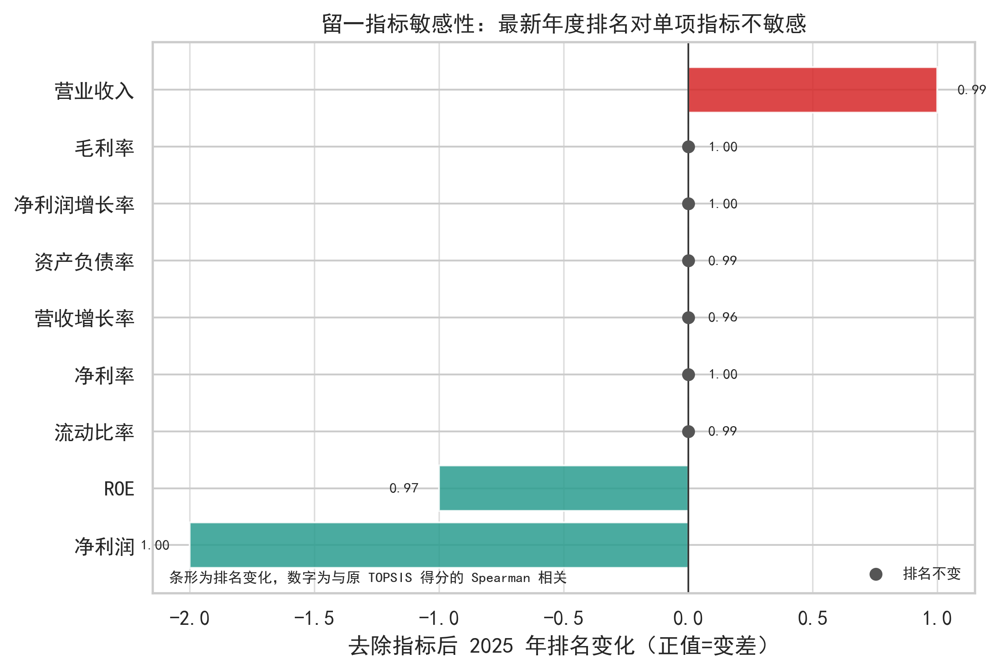

**文件**：`outputs/figures/leave_one_indicator_sensitivity.png`

**用途**：检验 TOPSIS 结论是否被某一个单独指标主导。

**怎么看**：每一行表示去掉一个指标后，2025 年排名的变化。正值表示排名变差，负值表示排名变好。旁边数字表示去掉该指标后得分序列与原 TOPSIS 得分的 Spearman 相关。

**说明意义**：去掉任一指标后，2025 年排名最大只变化 2 位，最低 Spearman 相关仍为 `0.961`。这说明评价结果较稳健，不是由某个单一指标机械决定。

**注意事项**：该图检验的是指标敏感性，不检验指标体系是否完整。若后续加入现金流、研发投入、费用率等新指标，仍可能改变综合评价。

## 三、原因解释图

### 7. 指标热力图

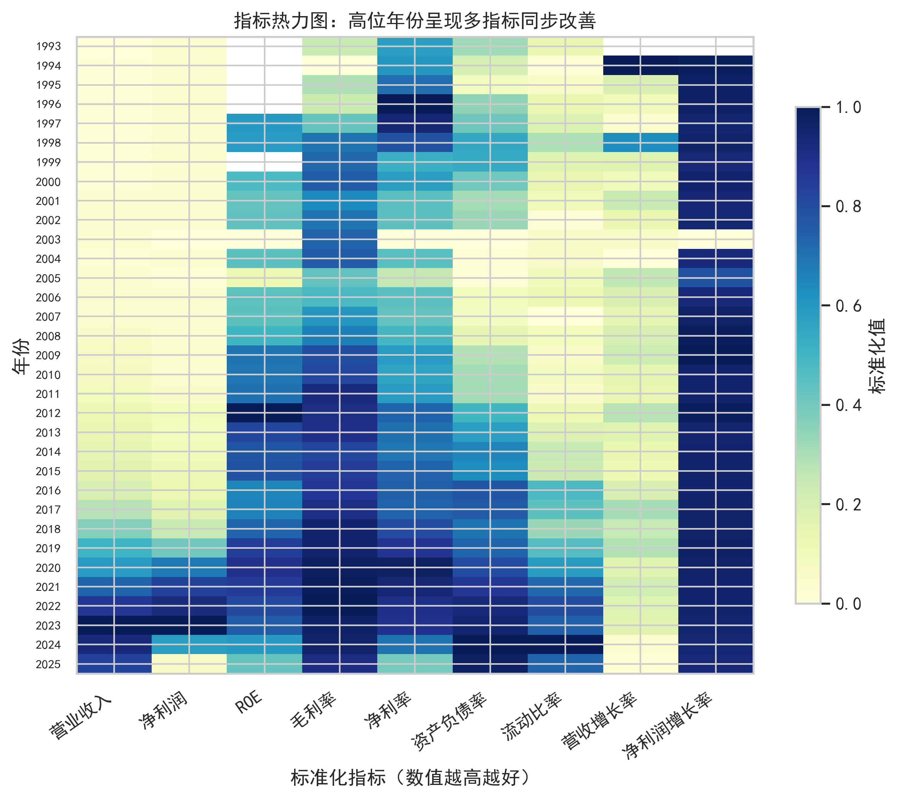

**文件**：`outputs/figures/indicator_heatmap.png`

**用途**：展示每个年份在各项标准化指标上的强弱结构。

**怎么看**：颜色越深表示该年度该指标越接近样本内较优水平；颜色越浅表示该指标相对较弱。

**说明意义**：2021-2023 年多项指标同步处于高位，而 2025 年在净利润、ROE、净利率等指标上明显转弱。这为“绩效回落主要由盈利能力下降驱动”提供了直接证据。

**注意事项**：早期年份部分指标存在缺失，热力图中留白或浅色区域需要结合数据表判断，不应过度解读为经营表现极差。

### 8. 2023 到 2025 退化贡献图

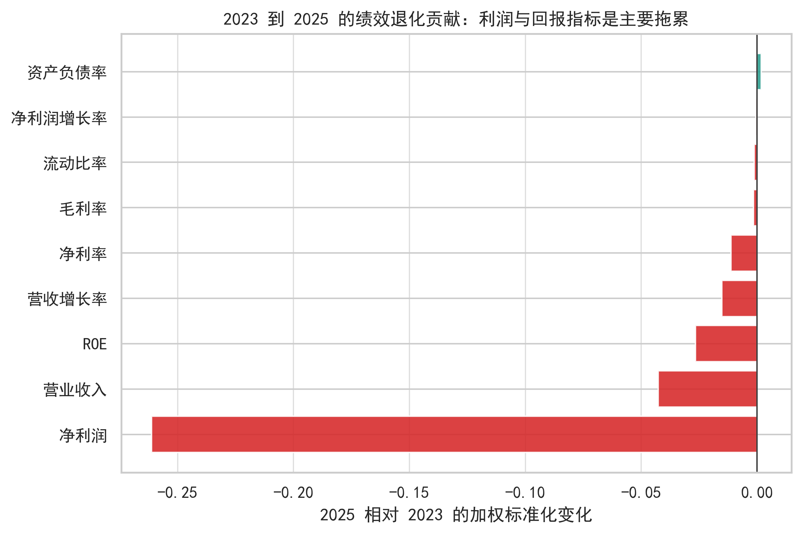

**文件**：`outputs/figures/degradation_contribution_2023_2025.png`

**用途**：拆解 2023 年高点到 2025 年之间综合绩效下降的指标来源。

**怎么看**：横轴为加权标准化变化。负值表示拖累绩效，正值表示支撑绩效。条越长，说明该指标贡献越大。

**说明意义**：净利润是最大负向贡献项，ROE、营收和净利率也形成拖累。资产负债率略有正向支撑，说明财务结构不是主要问题。

**注意事项**：该图反映的是评价模型中的指标贡献，不等同于会计利润变动的完整原因分解。若要解释净利润下降的业务原因，还需要年报附注和分业务数据。

### 9. 熵权与 PCA 载荷对比图

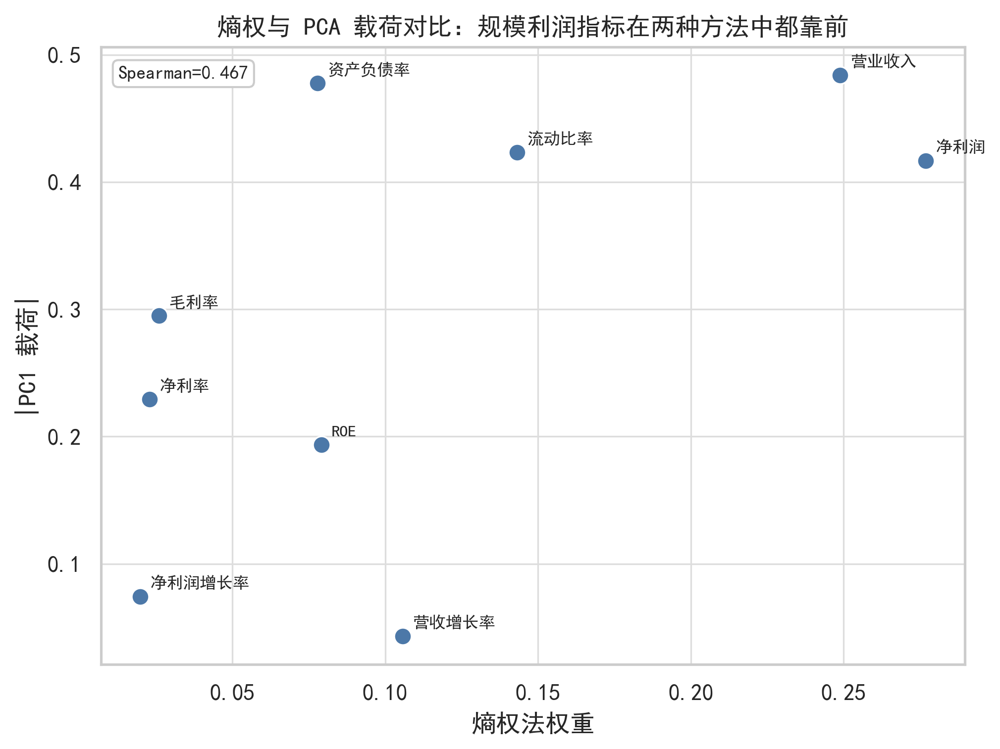

**文件**：`outputs/figures/entropy_vs_pca_loading.png`

**用途**：比较熵权法和 PCA 对指标重要性的判断是否一致。

**怎么看**：横轴为熵权法权重，纵轴为 PC1 载荷绝对值。越靠右上，说明该指标在两种方法中都更重要。

**说明意义**：规模和利润类指标在两种方法下都具有较强解释力，说明综合绩效评价并非只由一种权重方法主观决定。两种方法从不同角度都指向收入、净利润和盈利能力的重要性。

**注意事项**：熵权和 PCA 载荷的含义不同。熵权强调指标差异信息量，PCA 载荷强调降维方向贡献，因此二者不需要完全一致。

### 10. 熵权法指标权重图

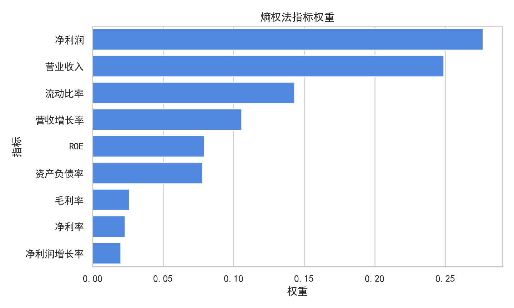

**文件**：`outputs/figures/entropy_weights.png`

**用途**：展示 TOPSIS 模型中各项指标的熵权权重。

**怎么看**：条形越长，说明该指标在综合评价中的权重越高。

**说明意义**：净利润、营业收入、流动比率、营收增长率和 ROE 等指标权重较高，解释了为什么利润端大幅下降会显著影响 2025 年综合绩效得分。

**注意事项**：熵权法根据样本差异自动赋权，不代表管理层或投资者主观认为该指标最重要。

## 四、阶段分布与结构图

### 11. 分阶段绩效分布图

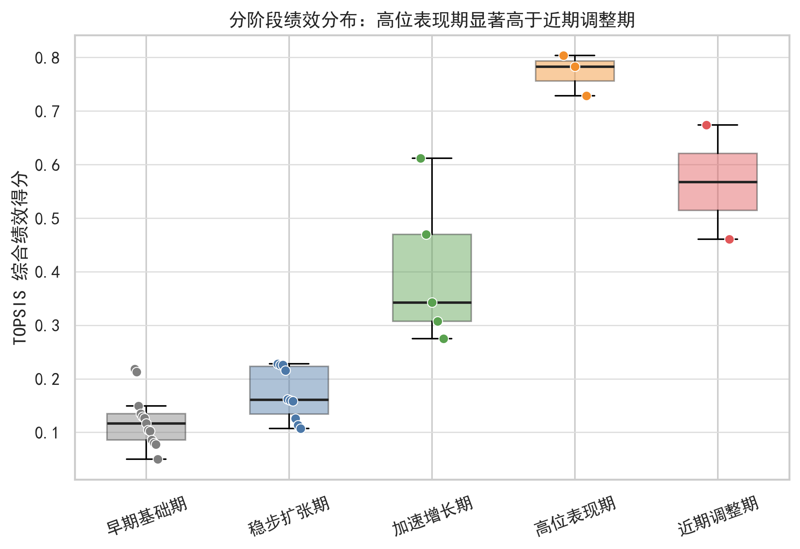

**文件**：`outputs/figures/stage_score_distribution.png`

**用途**：比较不同发展阶段的 TOPSIS 综合绩效得分分布。

**怎么看**：箱体表示该阶段得分的集中范围，散点表示具体年份得分。箱体越高，说明该阶段整体绩效越好。

**说明意义**：高位表现期的得分明显高于近期调整期，高位表现期中位得分约为 `0.783`，近期调整期中位得分约为 `0.567`。这说明“高位后回落”不仅是个别年份现象，而是阶段层面的变化。

**注意事项**：高位表现期和近期调整期年份数量较少，箱线图更适合做阶段性辅助证据，而不是严格统计推断。

### 12. 指标雷达图

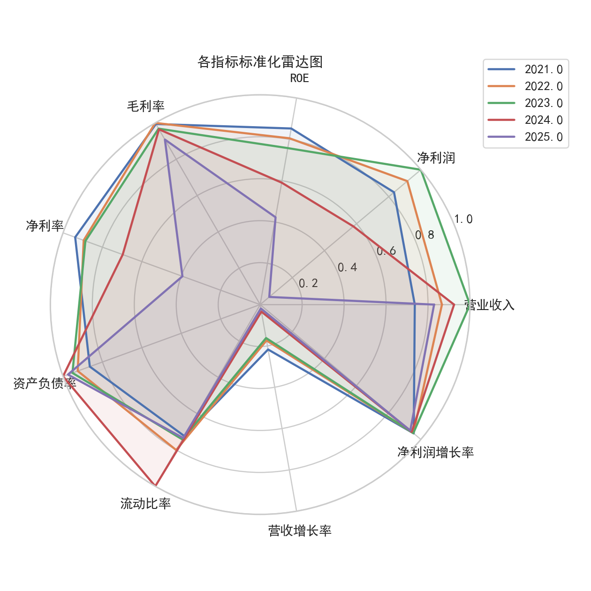

**文件**：`outputs/figures/indicator_radar.png`

**用途**：展示最近若干年度在多个标准化指标上的综合轮廓。

**怎么看**：每条闭合线代表一个年份。某个方向越靠外，说明该年份在该指标上越接近样本内较优水平。

**说明意义**：雷达图适合比较 2021-2025 年之间的指标结构差异，能够看到 2025 年相对高位年份在利润和回报能力维度上的收缩。

**注意事项**：雷达图维度较多时不适合读取精确数值，应作为结构概览图使用。

## 五、基础趋势图

### 13. 营业收入趋势图

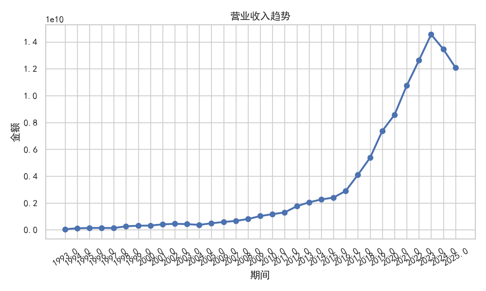

**文件**：`outputs/figures/trend_revenue.png`

**用途**：展示营业收入长期变化。

**怎么看**：折线向上表示收入规模扩张，折线向下表示收入收缩。

**说明意义**：公司收入在 2023 年前后达到高位，之后出现回落。该图说明 2025 年绩效压力不仅来自利润率，也有收入规模下降的影响。

**注意事项**：收入趋势无法解释利润下降的具体原因，需要结合毛利率、费用率和产品结构。

### 14. 净利润趋势图

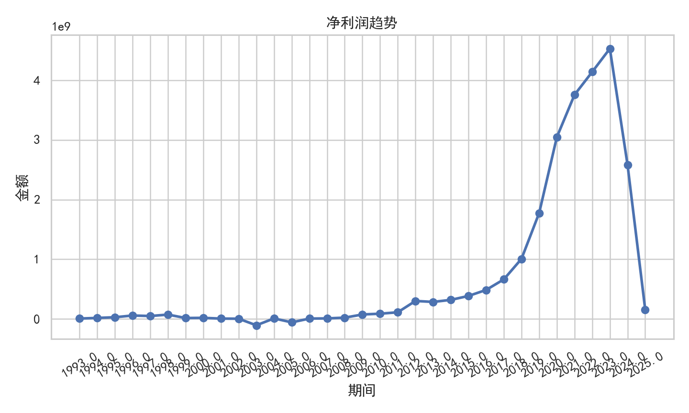

**文件**：`outputs/figures/trend_net_profit.png`

**用途**：展示净利润长期变化。

**怎么看**：折线越高表示净利润越高；快速下行表示盈利规模明显收缩。

**说明意义**：净利润在 2021-2023 年处于高位，2024 年明显回落，2025 年进一步大幅下降，是综合绩效走弱的核心拖累。

**注意事项**：净利润受主营业务、费用、减值、非经常性损益等多因素影响。该图说明结果，不直接解释全部原因。

### 15. ROE 趋势图

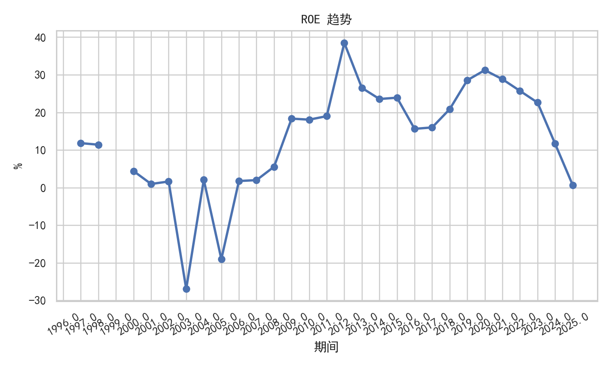

**文件**：`outputs/figures/trend_roe.png`

**用途**：展示净资产收益率变化，反映资本回报能力。

**怎么看**：ROE 越高，说明同等权益资本创造利润的能力越强。

**说明意义**：ROE 在高位年份表现较好，但 2024-2025 年明显回落，说明利润下降已经传导到资本回报效率。

**注意事项**：ROE 会受利润和权益规模共同影响，需要结合净利润趋势判断。

### 16. 资产负债率趋势图

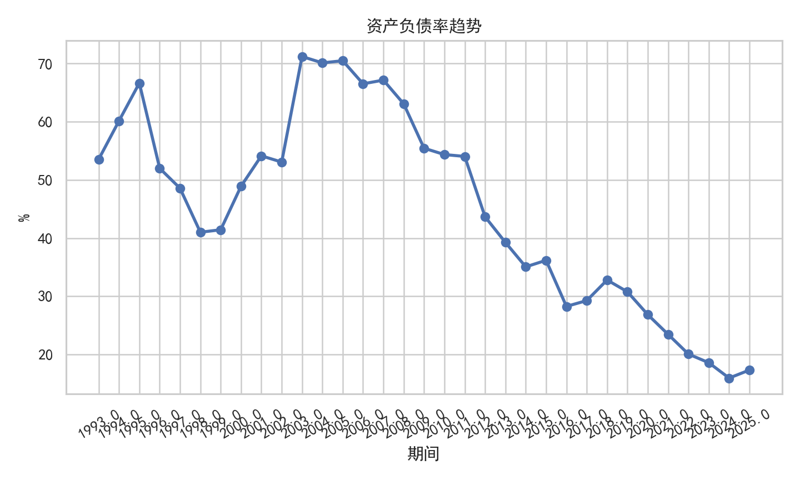

**文件**：`outputs/figures/trend_asset_liability_ratio.png`

**用途**：展示公司偿债压力和资本结构变化。

**怎么看**：资产负债率越高，通常说明负债占资产比例越高；越低则杠杆压力较小。

**说明意义**：近年来资产负债率处于较低区间，说明公司最新阶段的主要问题不是债务压力，而是盈利和经营效率下滑。

**注意事项**：较低资产负债率不一定代表经营绩效优秀，只能说明财务结构相对稳健。

### 17. 股价与综合绩效得分对比图

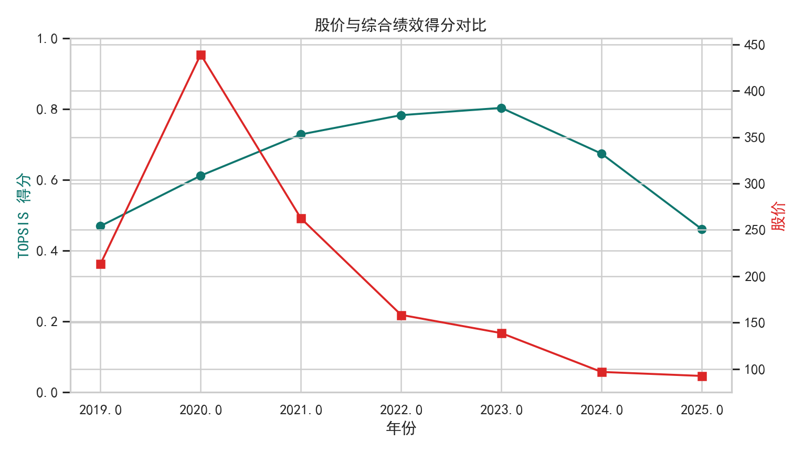

**文件**：`outputs/figures/price_vs_topsis_score.png`

**用途**：比较公司股价走势与综合绩效得分变化是否同向。

**怎么看**：一条线表示 TOPSIS 得分，另一条线表示年末收盘价。两者同向变化说明市场表现和经营绩效变化方向较一致。

**说明意义**：高位之后，股价和综合绩效均出现回落，说明经营绩效弱化与市场预期调整方向大体一致。

**注意事项**：股价受估值、市场情绪、行业政策、流动性等多因素影响，不能简单等同于经营绩效。

## 图表使用建议

### 报告正文推荐使用

建议在绩效评价报告正文中优先使用以下图表：

1. `streamlit_trends.png`：先展示经营指标整体变化。
2. `topsis_score.png` 或 `topsis_rank_bump.png`：展示综合绩效主结论。
3. `pca_topsis_robustness.png`：证明评价结论稳健。
4. `degradation_contribution_2023_2025.png`：解释 2025 年回落原因。
5. `indicator_heatmap.png`：作为多指标共振证据。

### 附录推荐使用

以下图表更适合放在附录或方法验证部分：

1. `leave_one_indicator_sensitivity.png`
2. `pca_2d_biplot.png`
3. `entropy_vs_pca_loading.png`
4. `stage_score_distribution.png`
5. `indicator_radar.png`

### 答辩时推荐讲法

可以按以下逻辑介绍图表：

1. 先用趋势图说明公司经营表现从高位回落。
2. 再用 TOPSIS 得分和排名轨迹证明综合绩效确实下降。
3. 然后用 PCA 和留一指标敏感性证明结论稳健。
4. 最后用退化贡献图和热力图说明主要拖累来自净利润、ROE、净利率等盈利与回报指标。

## 数据与方法说明

本报告中的图表主要基于以下文件：

- `data/processed/financial_indicators.csv`
- `data/processed/standardized_matrix.csv`
- `outputs/tables/topsis_scores.csv`
- `outputs/tables/entropy_weights.csv`
- `outputs/tables/plot_data_pca_coordinates.csv`
- `outputs/tables/plot_data_pca_loadings.csv`

所有 PCA 和高级诊断图均保留了 `trace.json`、`figure_contracts.csv` 和 `figure_source_map.csv`，可追溯到源数据、生成脚本和图表设计目的。

