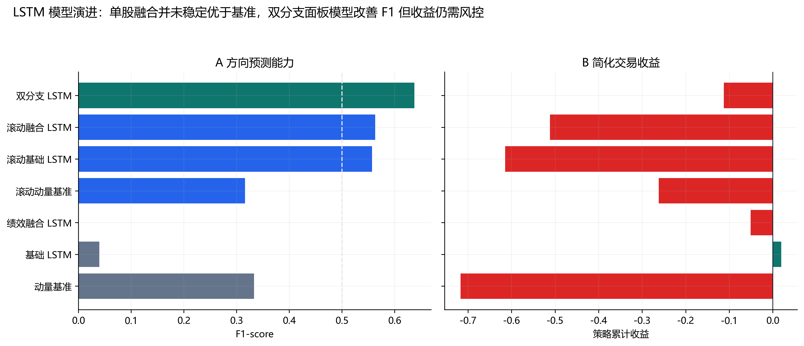
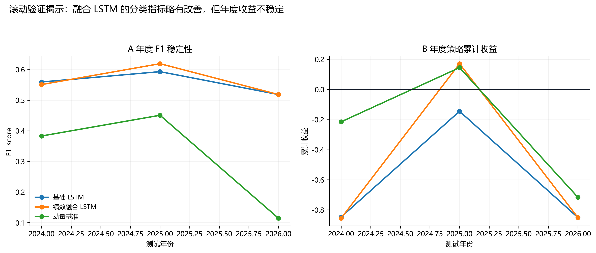
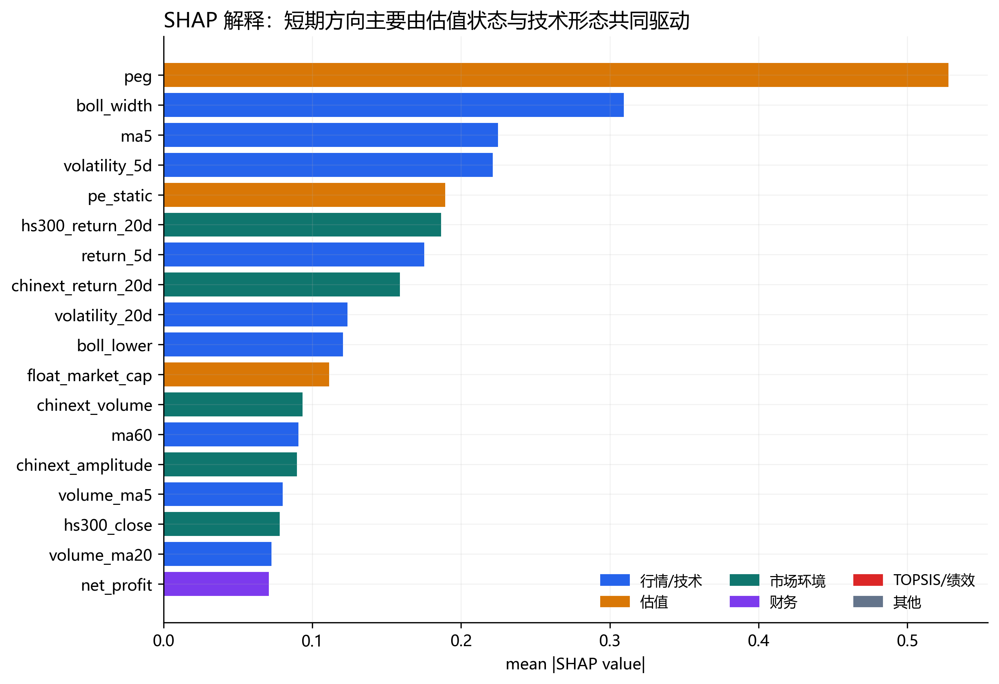
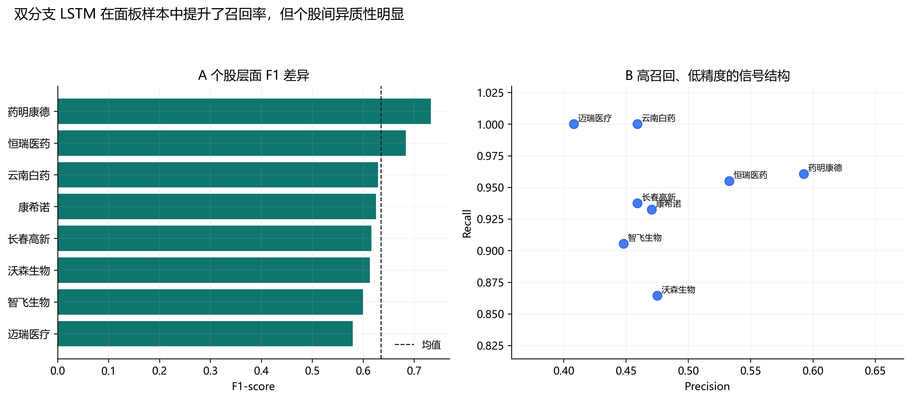
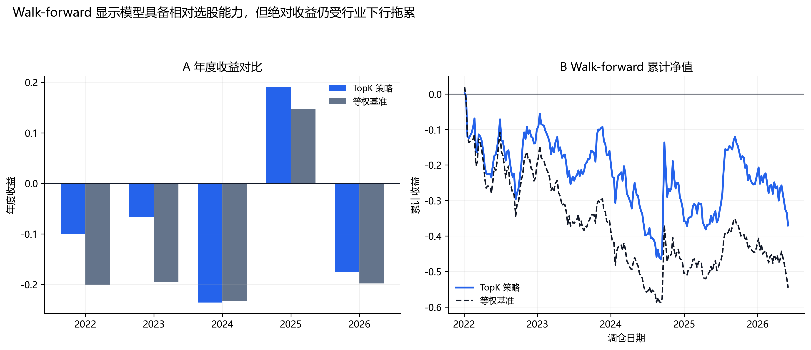

# 基于 TOPSIS 经营绩效融合的 LSTM 股价趋势预测完整报告

## 摘要

本报告在长春高新经营绩效评价基础上，构建未来 5 个交易日方向预测任务，并依次评估单股 LSTM、绩效融合 LSTM、滚动验证、SHAP 解释、同行面板双分支 LSTM 以及 walk-forward 截面 TopK 回测。核心结论是：低频经营绩效和 TOPSIS 得分可以作为解释性补充，但短期股价方向仍主要受估值、技术形态和市场环境驱动；双分支 LSTM 能改善分类 F1，但若没有市场状态过滤和仓位控制，绝对收益仍不稳定。

## 1. 研究目标与预测任务

研究目标不是直接预测股价点位，而是预测未来 5 个交易日累计收益 `future_5d_return` 是否大于 0。该任务将股价尺度、复权处理和极端价格误差的影响降到较低水平，更适合与交易信号、组合回测和方向命中率指标连接。输入窗口设置为过去 20 个交易日。

## 2. 数据与特征体系

数据包括前复权 OHLCV、成交额、换手率、均线、收益率、波动率、RSI、MACD、布林带、沪深300/中证医药/创业板指数特征、估值与市值字段。经营绩效侧包含收入、净利润、ROE、毛利率、净利率、资产负债率、流动比率、收入增速、净利润增速、TOPSIS 得分和排名。财务数据按披露日 `merge_asof` 映射到交易日，避免在公告披露前使用未来财务信息。

## 3. 模型设计

基础 LSTM 使用日频行情、技术指标、指数和估值变量作为时间序列输入；融合 LSTM 在此基础上纳入已经披露的经营绩效与 TOPSIS 信息。双分支 LSTM 将快变量和慢变量分开处理：日频行情/技术/指数/估值进入 LSTM 分支，财务/TOPSIS/公司与行业哑变量进入 MLP 静态分支，二者拼接后输出未来 5 日上涨概率。该结构避免把年频财务指标简单复制成日频序列后完全交给 LSTM 学习。

## 4. 单股 LSTM 结果

单次时间切分结果如下：

```text
metric          Accuracy  F1-score  buy_hold_cum_return  max_drawdown  strategy_cum_return
model                                                                                     
base              0.6226    0.0396              -0.8828        0.0000               0.0195
fusion            0.6109    0.0000              -0.8828       -0.0506              -0.0506
naive_momentum    0.4864    0.3333              -0.8828       -0.7806              -0.7169
```

该结果显示，单次切分中基础 LSTM 和融合 LSTM 的分类 F1 并不理想，融合信息没有稳定转化为更强的短期方向预测能力。这一阶段的意义在于建立可运行的序列预测管线，而不是证明单股模型已具备稳定交易价值。



## 5. 滚动验证与最新信号

滚动验证均值如下：

```text
metric          Accuracy  F1-score  strategy_cum_return
model                                                  
base              0.3970    0.5571              -0.6144
fusion            0.3998    0.5630              -0.5116
naive_momentum    0.4731    0.3160              -0.2620
```

最新滚动信号日期为 `2026-06-11`，模型为 `fusion`，收盘价 `64.32`，上涨概率 `0.4733`，阈值 `0.50`，信号为 `stay_flat`。滚动验证比单次切分更接近真实部署，因为每个测试年份只能使用之前的数据。



## 6. SHAP 可解释性

SHAP 代理模型指标如下：

```text
            model           metric  value
shap_proxy_fusion         Accuracy 0.5808
shap_proxy_fusion        Precision 0.4660
shap_proxy_fusion           Recall 0.4706
shap_proxy_fusion         F1-score 0.4683
shap_proxy_fusion DirectionHitRate 0.5808
```

Top SHAP 特征如下：

```text
           feature  mean_abs_shap
               peg         0.5277
        boll_width         0.3095
               ma5         0.2248
     volatility_5d         0.2213
         pe_static         0.1892
  hs300_return_20d         0.1867
         return_5d         0.1753
chinext_return_20d         0.1589
    volatility_20d         0.1236
        boll_lower         0.1206
```

解释结果表明，`peg`、布林带宽度、短期均线、波动率、指数收益等特征贡献靠前。经营绩效/TOPSIS 信息更适合作为慢变量和状态变量，不宜被解释为短期股价方向的唯一主因。



## 7. 双分支 LSTM 面板扩展

双分支 LSTM 的关键指标如下：

```text
             metric   value
           Accuracy  0.4949
          Precision  0.4808
             Recall  0.9449
           F1-score  0.6373
strategy_cum_return -0.1126
buy_hold_cum_return -0.3740
       max_drawdown -0.8364
         best_epoch  5.0000
          threshold  0.2800
```

双分支模型在测试集上取得较高召回率和 `F1-score = 0.6373`，策略累计收益为 `-0.1126`，同期买入持有收益为 `-0.3740`。这说明模型相对单股 LSTM 有明显分类改善，但仍存在精度不足、阈值敏感和回撤偏大的问题。



## 8. Walk-forward 截面 TopK 检验

为避免固定测试集带来的过拟合错觉，进一步进行了逐年 walk-forward 检验：测试年前一年作为验证集选择阈值，验证年前所有历史数据作为训练集，然后在测试年按预测概率进行非重叠 5 日 TopK 调仓。当前最优组合为 `lightgbm_financial` / Top5，总收益 `-0.3705`，等权基准 `-0.5455`，超额收益 `0.1751`。

最优组合年度拆解如下：

```text
      source            variant  top_k  min_probability  year  periods  total_return  benchmark_total_return  excess_total_return  max_drawdown  win_rate  avg_turnover  avg_selected_count
walk_forward lightgbm_financial      5              0.0  2022       49       -0.1007                 -0.2010               0.1003       -0.2979    0.4898        0.4531                 5.0
walk_forward lightgbm_financial      5              0.0  2023       48       -0.0661                 -0.1947               0.1286       -0.2106    0.5208        0.5333                 5.0
walk_forward lightgbm_financial      5              0.0  2024       49       -0.2358                 -0.2323              -0.0035       -0.3289    0.3469        0.2449                 5.0
walk_forward lightgbm_financial      5              0.0  2025       48        0.1905                  0.1471               0.0434       -0.1526    0.5208        0.5417                 5.0
walk_forward lightgbm_financial      5              0.0  2026       20       -0.1761                 -0.1979               0.0219       -0.2060    0.5000        0.4800                 5.0
```

结果表明模型在 2022、2023、2025、2026 年具有相对抗跌或增强能力，但 2024 年失效，说明后续必须引入市场状态过滤、动态仓位和不交易区间。



## 9. 局限性

第一，样本仍集中在医药及相关同行，行业系统性下行会压制绝对收益。第二，财务和 TOPSIS 特征为低频变量，对 5 日短周期预测的边际贡献有限。第三，当前交易回测仅考虑单边交易成本，尚未加入滑点、涨跌停无法成交、停牌、成交量约束和组合容量。第四，双分支 LSTM 召回率高但精度偏低，容易在弱势环境中维持过多仓位。第五，SHAP 使用 LightGBM 代理解释，不等同于直接解释 PyTorch LSTM 内部状态。

## 10. 后续优化方向

后续优先级应从继续堆模型转向风控和验证口径：一是加入沪深300/中证医药趋势过滤，在行业弱势时降低仓位；二是基于预测概率分布设置不交易区间，概率不够分散时空仓；三是使用 walk-forward 方式重训双分支 LSTM，而不是只做固定切分；四是引入概率校准和分组阈值，缓解高召回、低精度结构；五是进一步扩展同行样本和宏观/资金流/分析师预期数据。

## 11. 图表追溯

本报告新增 5 张图，均已导出 SVG、PNG、PDF 和 trace 文件，并写入 `outputs/tables/figure_contracts.csv` 与 `outputs/tables/figure_source_map.csv`。

```text
                      figure_id                                                     core_conclusion                                                                                                                                source_data_paths                                              output_targets
       lstm_fig1_model_progress            双分支 LSTM 的 F1-score 明显高于单股 LSTM，但策略收益仍为负，说明模型提升不能替代交易风控。                                 outputs/tables/lstm_metrics.csv; outputs/tables/lstm_rolling_metrics.csv; outputs/tables/dual_branch_metrics.csv        outputs/figures/lstm_fig1_model_progress.svg/png/pdf
    lstm_fig2_rolling_stability                     融合 LSTM 的平均 F1 略高，但不同年份策略收益波动较大，模型需要滚动验证而非单次切分。                                                                                                          outputs/tables/lstm_rolling_metrics.csv     outputs/figures/lstm_fig2_rolling_stability.svg/png/pdf
  lstm_fig3_shap_explainability                      PEG、布林带宽度、均线、波动率和指数收益等特征贡献靠前，短期方向更依赖估值与市场技术状态。                                                                        outputs/tables/shap_importance.csv; outputs/tables/shap_proxy_metrics.csv   outputs/figures/lstm_fig3_shap_explainability.svg/png/pdf
    lstm_fig4_dual_branch_panel                        药明康德、恒瑞医药等样本 F1 较高，但整体呈现高召回、低精度结构，阈值和风控仍是关键。                                                                                                    outputs/tables/dual_branch_symbol_metrics.csv     outputs/figures/lstm_fig4_dual_branch_panel.svg/png/pdf
lstm_fig5_walk_forward_strategy 最优 walk-forward Top5 组合跑赢等权基准 17.5 个百分点，但总收益仍为负，说明模型具有相对收益而非绝对收益保证。 outputs/tables/walk_forward_topk_metrics.csv; outputs/tables/walk_forward_topk_yearly_metrics.csv; outputs/tables/walk_forward_topk_backtest.csv outputs/figures/lstm_fig5_walk_forward_strategy.svg/png/pdf
```